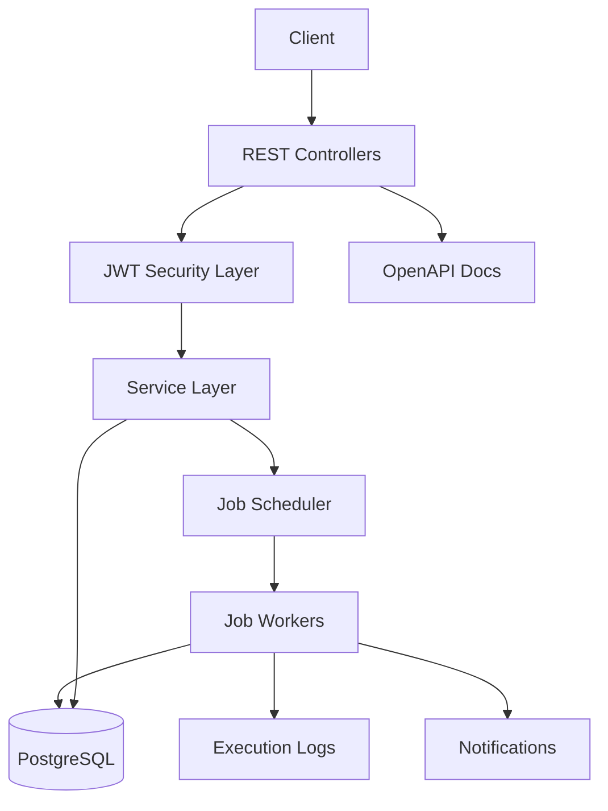
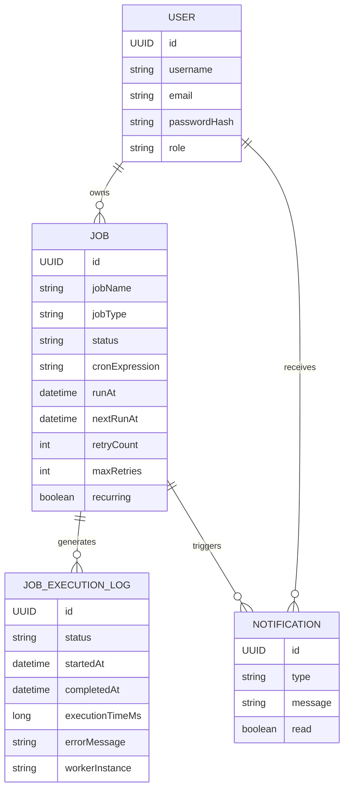
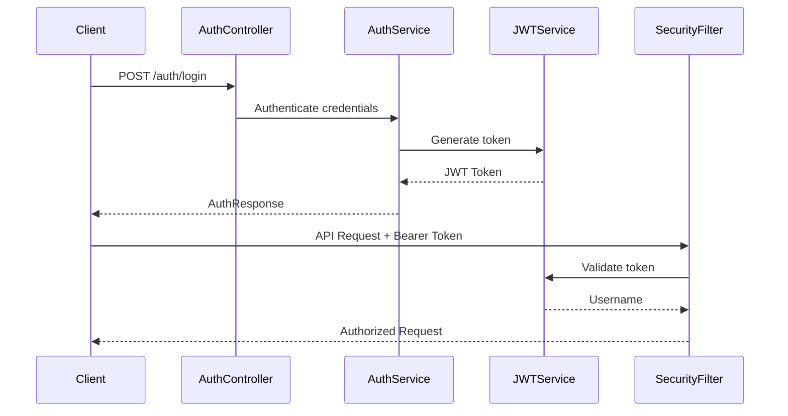
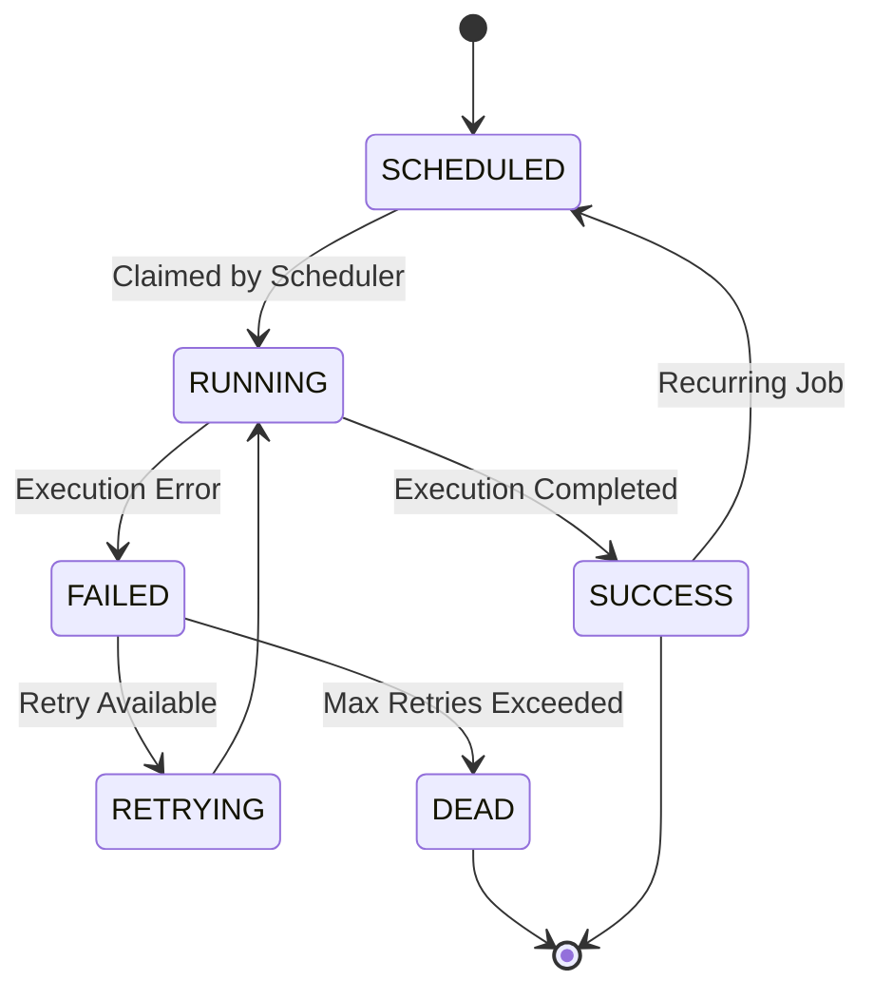

# Chronos

Distributed Job Scheduler System built with Spring Boot for scheduling, executing, monitoring, and managing background jobs with JWT-based authentication and recurring execution support.

---

# Overview

Chronos is a backend-focused distributed job scheduling platform designed to manage asynchronous and recurring workloads through REST APIs.

The system supports:

* One-time job scheduling
* Recurring cron-based jobs
* Retry handling for failed executions
* Job cancellation and rescheduling
* Execution logging
* JWT authentication and authorization
* Monitoring endpoints

The project demonstrates scalable backend architecture patterns using Spring Boot, PostgreSQL-compatible persistence, transactional job claiming, and concurrent worker execution.

---

# Features

* JWT-based authentication
* Secure REST APIs
* One-time job scheduling
* Cron-based recurring jobs
* Retry and failure handling
* Job cancellation and rescheduling
* Execution logging
* Concurrent worker execution
* OpenAPI/Swagger documentation
* Health and metrics monitoring
* Database migrations with Flyway

---

# Tech Stack

| Category           | Technology                  |
| ------------------ | --------------------------- |
| Backend Framework  | Spring Boot                 |
| Language           | Java                        |
| Database           | PostgreSQL                  |
| ORM                | Spring Data JPA / Hibernate |
| Security           | Spring Security + JWT       |
| Scheduler          | Spring Scheduler            |
| API Documentation  | Swagger / OpenAPI           |
| Database Migration | Flyway                      |
| Validation         | Jakarta Validation          |
| Logging            | SLF4J + Logback             |
| Build Tool         | Maven                       |
| Testing            | JUnit, Spring Boot Test     |
| Concurrency        | ExecutorService             |

---

# Architecture Overview



---

# Project Structure

```text
src/main/java/com/chronos
├── config
├── controller
├── dto
├── entity
├── exception
├── repository
├── scheduler
├── security
├── service
└── ChronosApplication.java
```

| Folder     | Responsibility                        |
| ---------- | ------------------------------------- |
| controller | REST API endpoints                    |
| service    | Business logic                        |
| repository | Database access                       |
| entity     | JPA entities                          |
| dto        | Request/response models               |
| scheduler  | Scheduling and worker execution       |
| security   | JWT authentication and authorization  |
| exception  | Global exception handling             |
| config     | OpenAPI and application configuration |

---

# Database Design

## Main Entities

### User

Stores authenticated platform users.

### Job

Represents scheduled jobs with execution metadata and retry state.

### JobExecutionLog

Stores execution history for every job execution attempt.

### Notification

Stores user notifications related to job failures and events.

---

## Entity Relationship Diagram



---

# Authentication & Security

Chronos uses JWT-based stateless authentication.

## Authentication Flow

1. User registers
2. User logs in
3. JWT token is generated
4. Client sends token in Authorization header
5. JWT filter validates request
6. SecurityContext is populated

---

## Security Flow



---

# Job Scheduling Flow

Chronos uses a polling scheduler combined with concurrent worker execution.

## Execution Lifecycle



---

# API Documentation

## Authentication APIs

| Method | Endpoint         | Description            | Auth Required |
| ------ | ---------------- | ---------------------- | ------------- |
| POST   | `/auth/register` | Register user          | No            |
| POST   | `/auth/login`    | Login and generate JWT | No            |

---

## Job APIs

| Method | Endpoint                | Description    | Auth Required |
| ------ | ----------------------- | -------------- | ------------- |
| POST   | `/jobs`                 | Create job     | Yes           |
| GET    | `/jobs`                 | Get all jobs   | Yes           |
| GET    | `/jobs/{id}`            | Get job by ID  | Yes           |
| PUT    | `/jobs/{id}/reschedule` | Reschedule job | Yes           |
| DELETE | `/jobs/{id}`            | Cancel job     | Yes           |

---

## Monitoring APIs

| Method | Endpoint            | Description      | Auth Required |
| ------ | ------------------- | ---------------- | ------------- |
| GET    | `/actuator/health`  | Health status    | No            |
| GET    | `/actuator/metrics` | Metrics endpoint | No            |

---

# Request & Response Examples

## Register User

### Request

```http
POST /auth/register
```

```json
{
  "username": "kiran",
  "email": "kiran@example.com",
  "password": "Password@123"
}
```

---

## Login

### Request

```http
POST /auth/login
```

```json
{
  "username": "kiran",
  "password": "Password@123"
}
```

### Response

```json
{
  "token": "eyJhbGciOiJIUzI1NiJ9...",
  "type": "Bearer"
}
```

---

## Create Job

### Request

```http
POST /jobs
Authorization: Bearer <JWT_TOKEN>
```

```json
{
  "jobName": "Daily Cleanup",
  "jobType": "DATABASE_CLEANUP",
  "priority": 5,
  "maxRetries": 3,
  "recurring": true,
  "cronExpression": "0 0 2 * * *"
}
```

---

## Success Response

```json
{
  "success": true,
  "message": "Job created",
  "data": {
    "id": "job-uuid"
  }
}
```

---

## Error Response

```json
{
  "success": false,
  "message": "Invalid cron expression"
}
```

---

# Validation Rules

Detected validations include:

| Field            | Validation             |
| ---------------- | ---------------------- |
| username         | Required               |
| email            | Valid email format     |
| password         | Required               |
| jobName          | Required               |
| priority         | Numeric validation     |
| maxRetries       | Numeric validation     |
| cronExpression   | Cron syntax validation |
| request payloads | `@Valid` validation    |

---

# Setup Instructions

## Prerequisites

* Java 17+
* Maven
* PostgreSQL

---

## Clone Repository

```bash
git clone <repository-url>
cd chronos
```

---

## Configure Environment Variables

```bash
export DB_URL=jdbc:postgresql://localhost:5432/chronos
export DB_USERNAME=postgres
export DB_PASSWORD=postgres
export JWT_SECRET=your-secret-key
```

---

## Run Database Migrations

Flyway migrations run automatically during application startup.

---

## Start Application

```bash
mvn spring-boot:run
```

---

# Environment Variables

| Variable    | Description             |
| ----------- | ----------------------- |
| DB_URL      | Database connection URL |
| DB_USERNAME | Database username       |
| DB_PASSWORD | Database password       |
| JWT_SECRET  | JWT signing secret      |

---

# Running the Application

## Maven

```bash
mvn clean install
mvn spring-boot:run
```

---

## Swagger UI

```text
http://localhost:8080/swagger-ui/index.html
```

---

## Health Endpoint

```text
http://localhost:8080/actuator/health
```

---

# Postman Usage

1. Import the Postman collection
2. Register or login user
3. Copy generated JWT token
4. Add token to Authorization header:

```text
Authorization: Bearer <token>
```

5. Execute job management APIs
6. Use Collection Runner for end-to-end workflow testing

---

# Logging & Monitoring

Chronos uses:

* SLF4J logging
* Structured application logs
* Spring Boot Actuator endpoints

Execution logs track:

* start time
* completion time
* execution duration
* worker instance
* execution status
* error messages

Monitoring endpoints:

* `/actuator/health`
* `/actuator/metrics`

---

# Design Decisions

## Scheduling Strategy

Spring Scheduler with polling-based job claiming was used to support asynchronous execution and recurring scheduling.

## Security

JWT-based stateless authentication simplifies API authorization and horizontal scalability.

## Retry Strategy

Jobs maintain retry metadata (`retryCount`, `maxRetries`) to support automatic retries and dead-state transitions.

## Scalability

Concurrent job execution is handled using a fixed thread pool executor.

---

# Error Handling

Chronos includes centralized exception handling through a global exception handler.

Handled scenarios include:

* validation failures
* invalid cron expressions
* authentication failures
* authorization failures
* retry exhaustion

Failed jobs transition to terminal states after retry limits are exceeded.

---

# Scalability Considerations

Implemented scalability patterns include:

* concurrent worker execution
* polling-based scheduler
* transactional job claiming
* retry-based recovery
* stateless JWT authentication
* database-backed scheduling persistence

---

# Future Improvements

* Distributed worker coordination
* Queue-based execution architecture
* WebSocket-based live monitoring
* Advanced retry backoff strategies
* Role-based access control
* Notification delivery integrations
* Dashboard UI
* Kubernetes deployment support

---

# Demo Section

## GitHub Repository
[AirTribe Capstone Project](https://github.com/KiranChavan45Dev/AirTribe/tree/main/Capstone)


## Demo Video

The repository includes demo videos and test result recordings to showcase the working functionality of the system.

📁 Location: `repo/test result`

NOTE: In case the file is not found here, please use the following link: [Demo Video (Google Drive)](https://drive.google.com/drive/folders/1p3o6-JhyJcQzDutERnIvjcYfLt5XvxBd?usp=drive_link)

---

# Author

**Kiran Chavan**

Backend Engineering Capstone Project — Chronos Job Scheduler System
