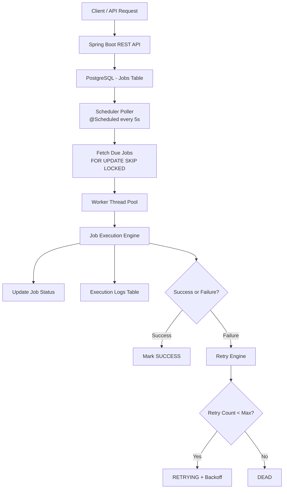
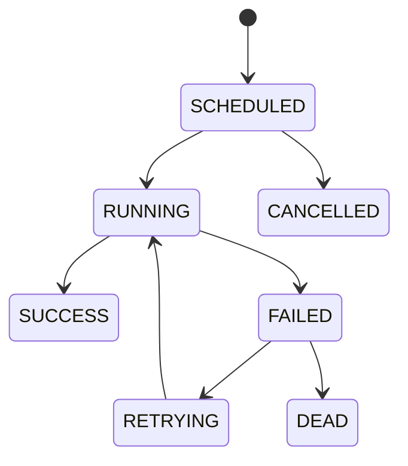
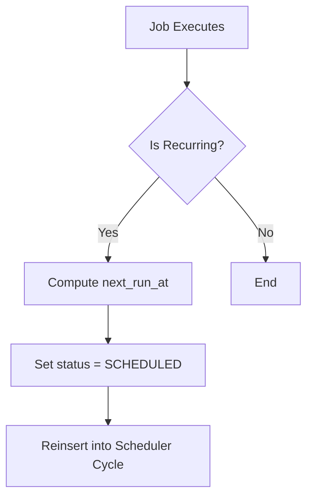
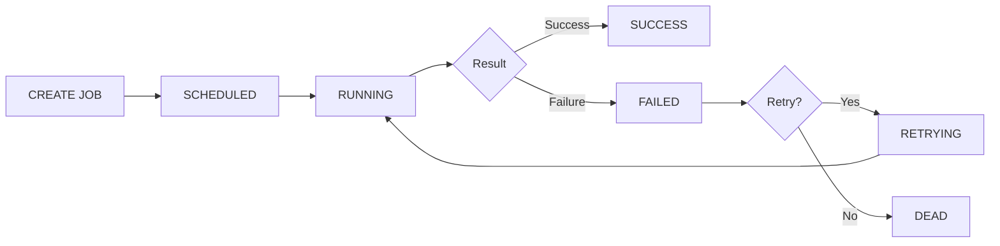

# 📌 Chronos — Distributed Job Scheduler

---

## 🚀 Overview

Chronos is a backend system for scheduling, executing, and managing delayed and recurring jobs. It is built using Java, Spring Boot, and PostgreSQL.

It demonstrates core backend engineering concepts like:

* distributed job execution
* concurrency control
* retry mechanisms
* state management
* system observability

---

# 🧠 System Architecture

## High-Level Design



---

# ⚙️ How the System Works

## 1. Job Creation

* User submits job via REST API
* Stored in PostgreSQL with status `SCHEDULED`

## 2. Scheduler Polling

* Background scheduler runs every 5 seconds
* Fetches due jobs:

    * `next_run_at <= now()`
    * `status IN (SCHEDULED, RETRYING)`

## 3. Concurrency Safety

* Uses PostgreSQL:

```sql
FOR UPDATE SKIP LOCKED
```

* Prevents duplicate job execution across multiple workers

## 4. Execution Flow

* Jobs submitted to worker thread pool
* Executed asynchronously

---

# 🔄 Job State Machine



---

# 🔁 Retry Mechanism

* Each job has `max_retries`
* On failure:

    * increment retry count
    * apply exponential backoff

Example:

```text id="retry1"
Retry 1 → +1 sec
Retry 2 → +2 sec
Retry 3 → +4 sec
```

If retries exceed limit → job becomes `DEAD`

---

# 🔄 Recurring Jobs Flow



---

# 🧱 Database Design

## Tables

* users
* jobs
* job_execution_logs
* notifications

---

## Key Design Choice

Instead of Kafka/RabbitMQ:

> PostgreSQL is used as a reliable job queue.

Using:

```sql
FOR UPDATE SKIP LOCKED
```

This enables:

* distributed-safe execution
* no duplicate processing
* horizontal scalability readiness

---

# 📊 Job Execution Lifecycle



---

# 🔐 Authentication

* JWT-based authentication
* Stateless Spring Security
* BCrypt password hashing

---

# 📡 API Endpoints

## Auth APIs

```http id="api1"
POST /auth/register
POST /auth/login
```

---

## Job APIs

```http id="api2"
POST   /jobs                 → Create job
GET    /jobs                 → List user jobs
GET    /jobs/{id}            → Get job
DELETE /jobs/{id}           → Cancel job
PUT    /jobs/{id}/reschedule → Reschedule job
```

---

# 🗄️ Database Schema

## Core Tables

* users
* jobs
* job_execution_logs
* notifications

---

# 📊 Observability

Enabled via Spring Actuator:

```text id="obs1"
/actuator/health
/actuator/metrics
```

Execution logs stored per job run for traceability.

---

# 🧱 Tech Stack

* Java 21
* Spring Boot
* Spring Security
* Spring Data JPA
* PostgreSQL
* Flyway
* JWT

---

# 🚀 Running the Project (NO DOCKER)

## Steps

```bash id="run1"
1. Create DB:
   CREATE DATABASE chronos;

2. Update application.yml with DB credentials

3. Run:
   mvn clean install

4. Start:
   Run ChronosApplication in IntelliJ
```

---

# 🔮 Future Improvements

* Kafka-based event queue
* Redis distributed locking
* Cron expression parser (full accuracy)
* Dead Letter Queue (DLQ)
* Admin dashboard UI
* Job timeout recovery system
* Horizontal worker scaling

---

# 🎯 Engineering Highlights

## ✔ Distributed Systems Design

* DB-backed job queue
* SKIP LOCKED concurrency model

## ✔ Fault Tolerance

* retry mechanism
* failure state handling

## ✔ Scalability

* stateless workers
* horizontal scheduler support

## ✔ Production Thinking

* execution logs
* monitoring hooks
* clean API design

---

# 🎤 Explainer Video Script

## 1. Introduction

> “Chronos is a distributed job scheduler built using Java and Spring Boot…”

---

## 2. Architecture

* REST APIs
* PostgreSQL queue
* Scheduler polling
* Worker thread pool

---

## 3. Execution Flow

* job lifecycle states
* success/failure transitions

---

## 4. Concurrency Model

> “Instead of Kafka, we use PostgreSQL row locking with SKIP LOCKED…”

---

## 5. Retry System

* exponential backoff
* max retry limit

---

## 6. Closing

> “This system simulates production-grade job scheduling systems with scalability and reliability built in.”

---